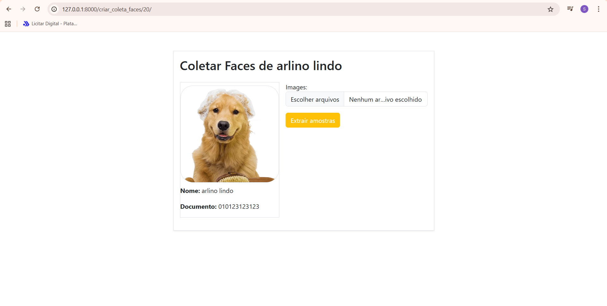

#### Criando projeto Reconhecimento Facial



* verificando a versão do python
```
python --version
```

* criando o ambiente virtual
```
python -m venv venv
```

* Ativa a versão venv
```
venv\Scripts\activate
```

* django
```
pip install django
```

* criando django projeto
```
django-admin startproject gestao .
```

* rodar as migration
```
python manage.py migrate
```

* rodando o projeto
```
python manage.py runserver
```

* projeto inicia na porta 8000
```
http://127.0.0.1:8000/
```

#### Configurando projeto
python manage.py collectstatic

* criando um app
python manage.py startapp registro

* configurando no apps
```
INSTALLED_APPS = [
    'django.contrib.admin',
    'django.contrib.auth',
    'django.contrib.contenttypes',
    'django.contrib.sessions',
    'django.contrib.messages',
    'django.contrib.staticfiles',
    'registro'
]
```

#### Rodando projeto
```
python manage.py runserver
```

#### 2 migrate
```
pip install pillow
```

```
python manage.py makemigrations
```
* entender a diferenja makemigrations e migrate
```
python manage.py migrate
```

#### Criando usuario django
```
python manage.py createsuperuser
```

#### usuario criado
rodrigo - 123123
sebastiao - 123123123

* acesso: http://localhost:8000/admin/

#### comando interessantes
```
python manage.py check
```